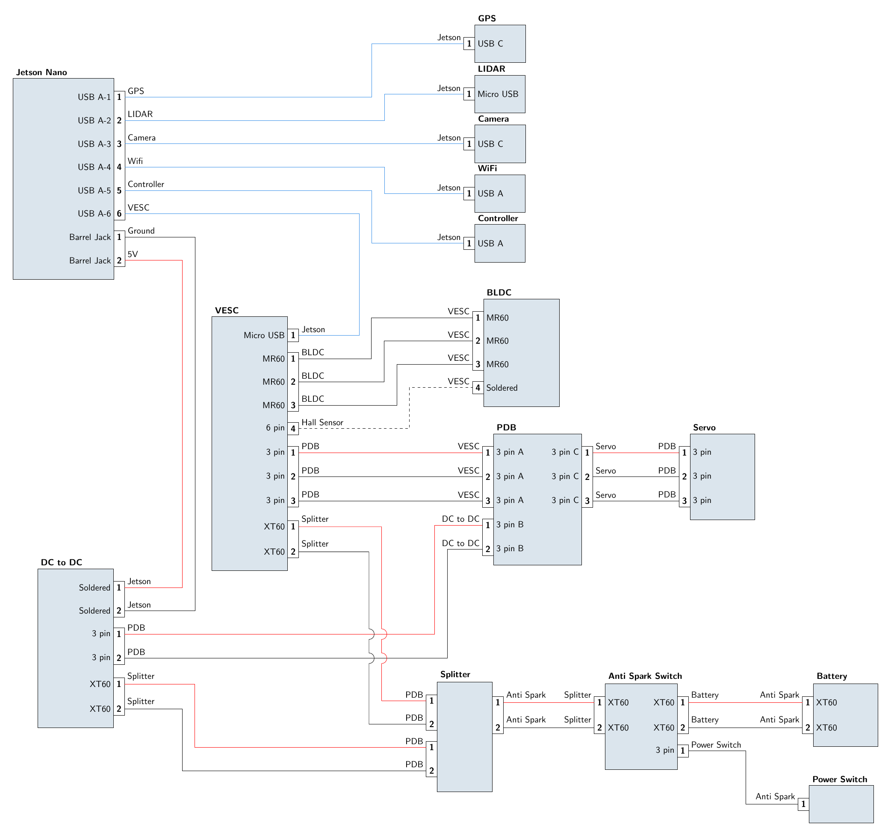

# MAE 148 SP24 Team 4

## Premise
SortBot is an autonomous vehicle that delivers items from one pickup point to different drop off locations.

## CAD
All parts modeled in Solidworks

## Schematic
Generated using LaTeX

## Software
Shape detection AI model
Path optimization
GPS navigation